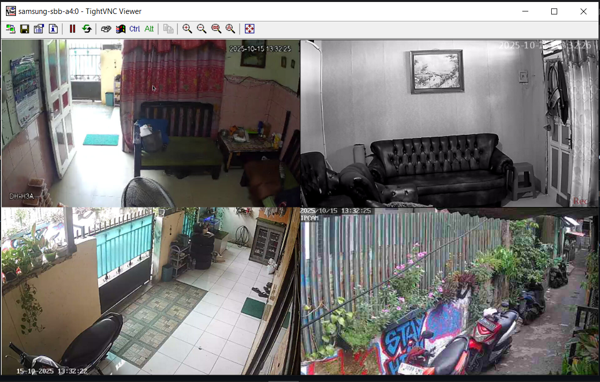

# 🧠 NVR GUI VAAPI

A lightweight **4-channel NVR viewer** built with **Qt5 + FFmpeg + VAAPI**, optimized for Debian 12 or Armbian-based headless systems.

---

## 📸 Overview
This project displays multiple RTSP/HTTP camera streams in a fullscreen **2×2 grid** layout, with automatic GPU offload (VAAPI) for decoding the highest-resolution stream. Designed for mini-PCs, Wyse thin clients, or embedded devices used as local CCTV/NVR displays.



---

## ⚙️ Features
- 🧩 **4-camera grid layout (2×2)**
- ⚙️ **Hardware decoding (VAAPI)** on `/dev/dri/renderD128`
- 💾 **JSON configuration** for camera URLs
- 🖥️ **Headless mode** using Xvfb + x11vnc
- 🔄 **Auto fullscreen** and live FPS logging
- 🧱 **Qt5 GUI** using FFmpeg backend

---

## 📂 Folder Structure
```
NVR-viewer-built-with-Qt5-FFmpeg-VAAPI-optimized-for-Debian-12/
└────start-nvr-test.sh
└────kill.sh
└────nvr-gui-vaapi/
      ├── src/
      └── main.cpp
      ├── CMakeLists.txt
      ├── config.json
   
```

---

## 🧰 Dependencies (Debian 12)
Install all required build tools and libraries:

```bash
sudo apt update && sudo apt upgrade -y
sudo apt install -y \
  build-essential cmake pkg-config \
  qtbase5-dev libqt5network5 \
  libavformat-dev libavcodec-dev libavutil-dev libswscale-dev \
  x11vnc xvfb matchbox-window-manager xdotool \
  libdrm-dev vainfo
```

### Optional (check GPU VAAPI support)
```bash
LIBVA_DRIVER_NAME=radeonsi vainfo --display drm --device /dev/dri/renderD128
```

---

## 🧱 Build Instructions

```bash
cd nvr/nvr-gui-vaapi
mkdir -p build && cd build
cmake ..
make -j$(nproc)
```

---

## ▶️ Run NVR GUI

```bash
bash start-nvr-test.sh
```

Access remotely via VNC viewer:
```
Server: <ip_address>:5900
```

Stop all background processes:
```bash
bash kill.sh
```

---

## ⚡ Example Output Log
```
[RTSP] ?? Memulai kamera "Ruang tamu 1"
[VAAPI] ?? Kamera "Ruang tamu 1" pakai VAAPI
[RTSP] ?? "Ruang tamu 1" 29.9 FPS (VAAPI)
```

---

## 🧩 File Descriptions

### `start-nvr-test.sh`
Runs Xvfb, matchbox, x11vnc, and launches the GUI in fullscreen mode.

### `kill.sh`
Stops all NVR processes (Xvfb, matchbox, x11vnc, nvr_gui).

### `config.json`
Lists all camera sources (RTSP or HTTP snapshot).

### `src/main.cpp`
Main C++ source implementing Qt-based GUI + FFmpeg + VAAPI decoding logic.

### `CMakeLists.txt`
Defines build configuration for Qt + FFmpeg integration.

---

## 📜 License
MIT © hashdashx

---
